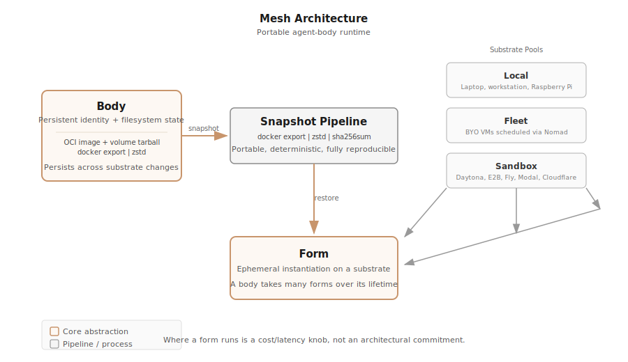

<p align="center">
  
</p>

<h1 align="center">Mesh</h1>

<p align="center">
  Portable agent-body runtime for AI agents.
  <br>
  Gives an agent a persistent compute identity that can live on any substrate
  and move between them without losing itself.
  <br>
  Self-hosted, user-owned, no central dependency.
</p>

<p align="center">
  <a href="https://github.com/rethink-paradigms/mesh/actions/workflows/ci.yml"></a>
  <a href="https://pkg.go.dev/github.com/rethink-paradigms/mesh"></a>
  <a href="https://goreportcard.com/report/github.com/rethink-paradigms/mesh"></a>
  <a href="LICENSE"></a>
  <a href="#"></a>
</p>

<p align="center">
  <a href="#what-is-mesh">Features</a> ·
  <a href="#comparison">Comparison</a> ·
  <a href="#quick-start">Quick Start</a> ·
  <a href="#architecture">Architecture</a> ·
  <a href="#documentation">Docs</a> ·
  <a href="#community">Community</a> ·
  <a href="#security">Security</a>
</p>

---

## What is Mesh

Containers were designed stateless. Kill and recreate, state in the DB. AI agents broke this. An agent is a persistent process that writes files as it works. The filesystem IS the state. Nothing in the existing stack is shaped for this.

Mesh gives AI agents a persistent body. The body is a filesystem. An agent installs packages, writes files, and modifies config. The body is the sum of all that state, portable as an OCI image plus volume tarball. Where it physically runs is a cost and latency knob, not an architectural commitment.

**Three core abstractions:**

- **Body.** Permanent identity and filesystem state. Persists across substrate changes.
- **Form.** Current physical instantiation on a specific substrate. Ephemeral by nature.
- **Substrate.** Where a form runs. Three pools: Local (laptop, Pi), Fleet (your BYO VMs via Nomad), Sandbox (cloud environments).

The snapshot primitive is `docker export | zstd | sha256sum`. A flat filesystem tarball. No memory state. Fully portable.

**Who this is for:** Agent builders who need persistent, portable compute for their agents. Small teams and solo developers who own their infrastructure. People who want to use natural language (MCP and skills) as their primary interface, not CLI commands.

---

## Key Features

- **Portable Agent Bodies.** Filesystem state as an OCI image plus volume tarball. The body is a flat `docker export | zstd` archive. No layer chains, no overlay complexity. The same workdir produces the same archive byte for byte.

- **Three Substrate Pools.** Run agents on your laptop (Local), your own VMs via Nomad (Fleet), or cloud sandboxes (Daytona, E2B, Fly, Modal, Cloudflare). Substrate is a runtime choice, not an architectural commitment.

- **Deterministic Snapshots.** Every snapshot produces three files: a zstd-compressed tarball, a SHA-256 digest, and a JSON manifest. Sorted workdir walk ensures byte-identical output from the same input. Enables change detection out of the box.

- **8-State Body Machine.** Created, Starting, Running, Paused, Stopping, Stopped, Error, Migrating. Every transition is validated and persisted before external operations execute. The Error state is a recoverable escape hatch.

- **MCP-Native Interface.** The primary interface is an MCP server over stdio JSON-RPC 2.0. AI agents manage their own bodies through 16 MCP tools. The CLI is a thin debugging surface for human operators (D5).

- **Plugin Architecture.** Substrate providers are plugins loaded at runtime. Uses go-plugin, gRPC, and protobuf. The core binary has zero provider code. Add a new substrate by writing a plugin, not modifying core (D6).

- **Runs on 2GB VMs.** Nomad (~80MB), Tailscale (~20MB), Docker (~100MB) fit in ~200MB of control plane, leaving 1.8GB for agent workloads. No Kubernetes required. No etcd, no CSI drivers, no control plane replica set. Ever (D3, C1, C2).

---

## Comparison

| Feature | Mesh | Daytona | E2B | Kubernetes |
|---|---|---|---|---|
| Agent-focused | Yes | Yes | Yes | No |
| Self-hosted | Yes | Yes | No | Yes |
| Portable snapshots | Yes | No | No | No |
| MCP-native | Yes | Yes | No | No |
| No K8s required | Yes | Yes | Yes | --- |
| Plugin providers | Yes | No | No | Yes |
| 2GB VM compatible | Yes | No | No | No |
| Body abstraction | Yes | No | No | No |

Mesh occupies a lane none of these fill: a lightweight, self-hosted, portable body runtime purpose-built for AI agents. Daytona is a managed platform for AI code execution (resource-heavy, AGPL). E2B is a cloud sandbox service (no portable snapshots, no import tarball API). Kubernetes is an orchestration platform designed for stateless microservices, not agent persistence. Mesh is simpler: Nomad plus Docker plus Tailscale, with bodies as the first-class abstraction.

---

## Quick Start

```bash
# Install
go install github.com/rethink-paradigms/mesh/cmd/mesh@latest

# Initialize configuration
mesh init

# Start the daemon
mesh serve
```

The daemon starts an MCP server on stdio. In another terminal, check its status:

```bash
mesh status
# Mesh daemon: running (pid 12345)
```

---

## Installation

**Go install** (primary)

```bash
go install github.com/rethink-paradigms/mesh/cmd/mesh@latest
```

Requires Go 1.25 or later. No CGo. No system dependencies beyond a working Go toolchain and Docker.

**Build from source**

```bash
git clone https://github.com/rethink-paradigms/mesh.git
cd mesh
go build -o /usr/local/bin/mesh ./cmd/mesh/
```

**Homebrew**

Coming soon. The formula is ready in the repository. Watch releases for the first tag.

**Docker**

```bash
docker pull ghcr.io/rethink-paradigms/mesh:latest
```

---

## Architecture



Mesh is a daemon-based system. The `mesh serve` process orchestrates a SQLite store (WAL mode), a Docker adapter (built-in), a body manager (8-state machine), a migration coordinator (7-step cold migration), and a plugin manager (go-plugin + gRPC).

For the full breakdown, see the [Architecture Documentation](docs/architecture.md), which covers the component design, state machine transitions, snapshot pipeline, migration coordinator, and config resolution.

---

## Documentation

Full documentation lives in the [docs/](docs/) directory:

| Topic | Link |
|---|---|
| Architecture overview | [docs/architecture.md](docs/architecture.md) |
| CLI reference | [docs/cli-reference.md](docs/cli-reference.md) |
| MCP API reference | [docs/mcp-api.md](docs/mcp-api.md) |
| Migration guide (v0 to v1) | [docs/migration.md](docs/migration.md) |
| Internal packages | [docs/internal/packages.md](docs/internal/packages.md) |

---

## Community

- [Contributing Guidelines](CONTRIBUTING.md) -- how to build, test, and submit changes
- [Code of Conduct](CODE_OF_CONDUCT.md) -- our community standards
- [GitHub Issues](https://github.com/rethink-paradigms/mesh/issues) -- report bugs and request features
- [GitHub Discussions](https://github.com/rethink-paradigms/mesh/discussions) -- ask questions and share ideas

---

## Security

See [SECURITY.md](SECURITY.md) for our security policy and vulnerability reporting process. Please do not open public issues for security vulnerabilities. Use GitHub's private vulnerability reporting instead.

---

## Changelog

See [CHANGELOG.md](CHANGELOG.md) for release history and version tracking.

---

## License

MIT. See [LICENSE](LICENSE) for the full license text.
