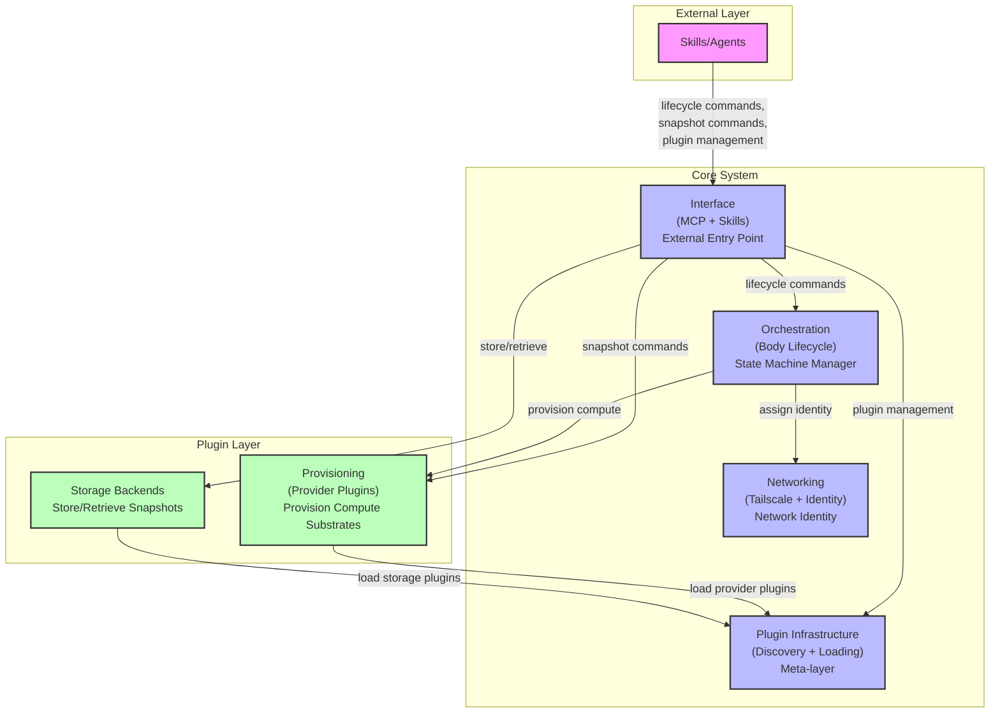

# Mesh Architecture Diagram

## Mermaid Flowchart



## ASCII Version

```
┌─────────────────────────────────────────────────────────────────────┐
│                        EXTERNAL LAYER                              │
│                                                                   │
│                        Skills/Agents                                │
└───────────────────────────────┬───────────────────────────────────┘
                                │
                                ▼
┌─────────────────────────────────────────────────────────────────────┐
│                         CORE SYSTEM                                │
│                                                                   │
│  ┌─────────────────────────────────────────────────────────────┐   │
│  │                    Interface (MCP + Skills)                 │   │
│  │                   External Entry Point                      │   │
│  └───────────────────────┬───────────────────────────────────┘   │
│                          │                                         │
│          ┌───────────────┼───────────────┐                      │
│          ▼               ▼               ▼                      │
│  ┌──────────────┐ ┌──────────────┐ ┌──────────────┐          │
│  │Orchestration │ │ Provisioning │ │Plugin Infra. │          │
│  │(Body Life-   │ │(Provider     │ │(Discovery +  │          │
│  │ cycle)       │ │ Plugins)     │ │ Loading)     │          │
│  └──────┬───────┘ └──────┬───────┘ └──────┬───────┘          │
│         │                 │                  │                     │
│         ▼                 └────────┬─────────┘                     │
│  ┌──────────────┐                  │                             │
│  │ Networking   │                  ▼                             │
│  │(Tailscale + │         ┌────────────────┐                     │
│  │ Identity)    │         │ Storage        │                     │
│  └──────────────┘         │ Backends       │                     │
│                          └────────────────┘                     │
└─────────────────────────────────────────────────────────────────────┘

                          PLUGIN LAYER
                    (Provisioning + Storage Backends)
```

## Legend

| Color/Section | Description |
|---------------|-------------|
| **External** | Skills and Agents that interact with the system |
| **Core** | Core modules: Interface, Orchestration, Networking, Plugin Infrastructure |
| **Plugin** | Extensible plugins: Provisioning providers, Storage backends |

## Module Descriptions

- **Interface (MCP + Skills)**: External entry point for the system. Handles lifecycle commands, snapshot operations, and plugin management.
- **Orchestration (Body Lifecycle)**: Manages the body state machine. Coordinates with Provisioning for compute resources and Networking for network identity.
- **Networking (Tailscale + Identity)**: Assigns network identity to bodies using Tailscale.
- **Plugin Infrastructure (Discovery + Loading)**: Meta-layer that enables dynamic loading of Provisioning and Storage plugins.
- **Provisioning (Provider Plugins)**: Plugin layer for provisioning compute substrates from various providers.
- **Storage Backends**: Plugin layer for storing and retrieving body snapshots.
