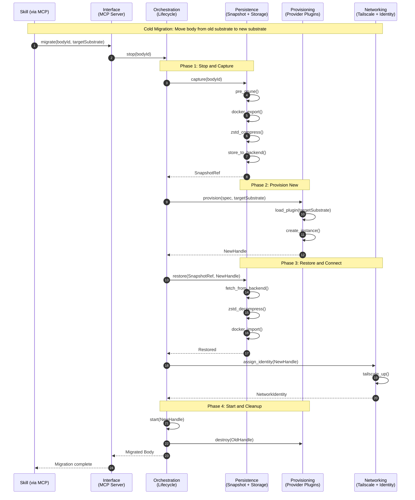

# Mesh System: Flow-Based Architecture

This diagram shows Mesh through its data flows and operations, not static module boxes.

## Three Core Operations

1. **Create Body** - Initialize a new agent body on a substrate
2. **Snapshot Body** - Persist body state to storage
3. **Migrate Body** - Move body between substrates (cold migration)

## Mermaid Sequence Diagram: Migrate Flow

The migration operation touches all six modules and demonstrates the full system flow.



## ASCII Flow Matrix: All Three Operations

Modules as columns, operations as rows.

```
              Interface    Provisioning  Orchestration  Persistence   Networking   Plugin Infra
              ─────────    ────────────  ─────────────  ───────────   ──────────   ────────────

CREATE         receive ────► load ───────► create ──────►              ──────────   discover
                           plugin         body
              ───────────► provision ────►              ──────────   ──────────   ──────────
                             instance
              ───────────►              ────► start ──►              ──────────   ──────────
              ───────────►              ────►          ──────────►  assign ID ──► ──────────
                                                                      
SNAPSHOT       receive ────►              ────► handle ─► capture ───► ──────────   ──────────
              ───────────►              ────►          ───► prune ──► ──────────   ──────────
              ───────────►              ────►          ───► export ─► ──────────   ──────────
              ───────────►              ────►          ───► compress► ──────────   ──────────
              ───────────►              ────►          ───► store ──► ──────────   ──────────
              ◄── ref ────              ◄───          ◄─── ref ◄─── ──────────   ──────────

MIGRATE        receive ────►              ────► stop ──►              ──────────   ──────────
(COLD)         ───────────►              ────►          ───► capture► ──────────   ──────────
               ───────────► provision ──►              ──────────   ──────────   load plugin
                             (target)
               ───────────►              ◄─── handle ◄── restore ◄── ──────────   ──────────
               ───────────►              ────►          ──────────   assign ID ──► ──────────
               ───────────►              ────► start ─►              ──────────   ──────────
               ───────────► destroy ────►              ──────────   ──────────   ──────────
                             (old)
               ◄── done ──              ◄───          ◄───         ◄───        ◄───
```

## Key Insight

**Migration is the archetypal flow.** If you understand migration, you understand the system — it touches all 6 modules, exercises both directions of data flow, and combines create + snapshot patterns into one coordinated sequence.