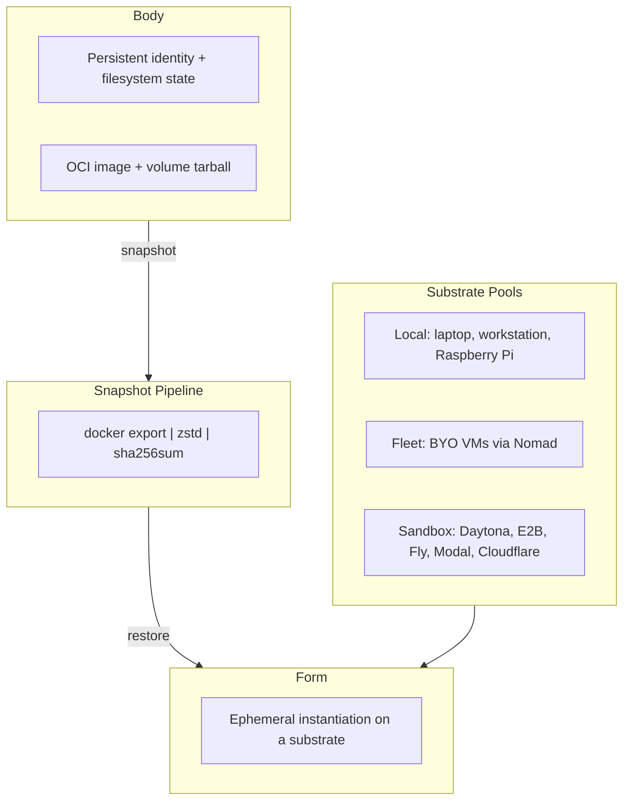

# Assets

This directory contains visual assets for the Mesh project documentation.

## Files

- **`mesh-architecture.svg`** — Architecture diagram showing the Body/Form/Substrate abstraction.

## Regenerating the Architecture Diagram

The diagram was authored as raw SVG. To modify it, edit `mesh-architecture.svg` directly with any vector graphics editor (e.g., Figma, Inkscape, Adobe Illustrator) or a text editor.

### Mermaid Source (for reference)

If you prefer to maintain the diagram as Mermaid and render it to SVG, the equivalent Mermaid source is:



### Rendering from Mermaid

1. Install the Mermaid CLI:
   ```bash
   npm install -g @mermaid-js/mermaid-cli
   ```

2. Save the Mermaid source above to a file (e.g., `mesh-architecture.mmd`).

3. Render to SVG:
   ```bash
   mmdc -i mesh-architecture.mmd -o mesh-architecture.svg
   ```

4. Copy the output to this directory:
   ```bash
   cp mesh-architecture.svg docs/assets/
   ```

### Design Constraints

- **Background**: White (for GitHub README readability)
- **Palette**: Monochrome/grayscale with one accent color (#C8956C — burnished copper)
- **Scope**: Conceptual only. No implementation details (Go packages, SQLite, gRPC).
- **Focus**: Body / Form / Substrate is the core concept.
